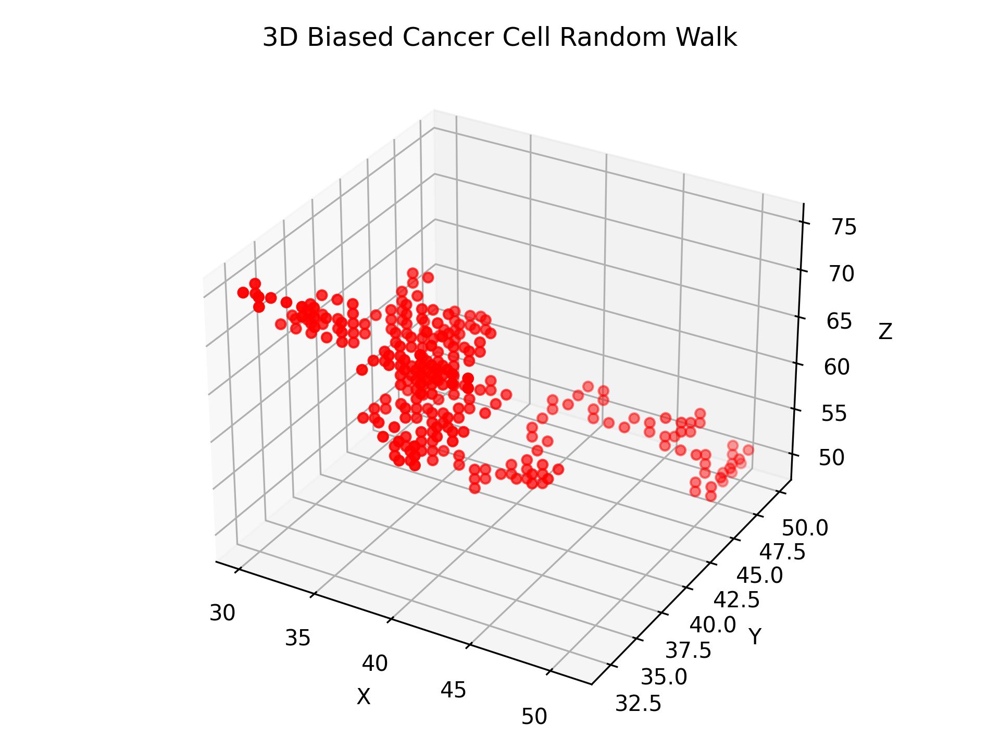

# Cancer Biophysics #D Random Walk Simulation

This repository contains a Python simulation of cancer cell movement, proliferation, and death within a 3D grid environment influenced by an oxygen gradient.

---

## Project Overview
Originally started and presented at the California School of Mathematics and Science (COSMOS 2025 at UC Davis), this Python simulation models how cancer cells propogate and die across a 3D tissue space with an oxygen gradient. This simulation employs a biased 3D random walk for probabilistic cell spawning, hypoxia-driven death, and for cancerous spread.

## Description
- Environment: 3D Cubical Grid, with oxygen concentration increasing gradually along the positive Z-axis
- Movement: Each walker (that models cancer spread) moves one grid unit per time step, with an option of 6 different directions, and a bias toward the higher oxygen area (+Z)
- Proliferation: Walkers may occasionally spawn new cells with a small probability
- Death: Cells in the hypoxic zones will die-off more often than not, as these cells lack the adequate nutrients to continue to survive

## Core Implementation:
- Moving the Walker:
def move_walker(x,y,z):
	# Moves the Walker from its original position (x,y,z) on the 3D Plane
	directions = [(1,0,0), (-1,0,0), (0,1,0), (0,-1,0), (0,0,1), (0,0,-1)]
	weights = [1,1,1,1,1+o_bias, 1-o_bias]
	weights = np.array(weights) / np.sum(weights)
	dx, dy, dz = directions[np.random.choice(len(directions), p=o_basew)]

After defining the movement directions, I elected to introduce the bias toward the positive Z-axis in this area of the code. I thought it would be the most reasonable, as the Z-axis is the tertiary axis that most people add, but it would also be simpler than a diagonal gradient based off a line that wasn’t normal to one of the three main axes (x, y, z).
Additionally, it was easiest to make the cancer cells only grow in 6 directions, as that retains most of the previous logic from 1D and 2D random walks. Plus, it avoids some nasty calculations for the alternative, a θ-based calculation off a certain axis.  While it would probably be more realistic for a tissue simulation, the simplicity, smoothness, and effectiveness of the simulation was more than enough.


##  Example Output  
Below is a sample result from running the simulation:



---

##  Getting Started & Usage
- Feel free to change the constants found in config.py to try different simulations. It was moved out of the main code in order to produce faster diagrams and a more cleaned up final product.
###  Clone the repo:
```bash
git clone https://github.com/hsumt/cancer-random-walk-biophysics.git
cd cancer-random-walk-biophysics
